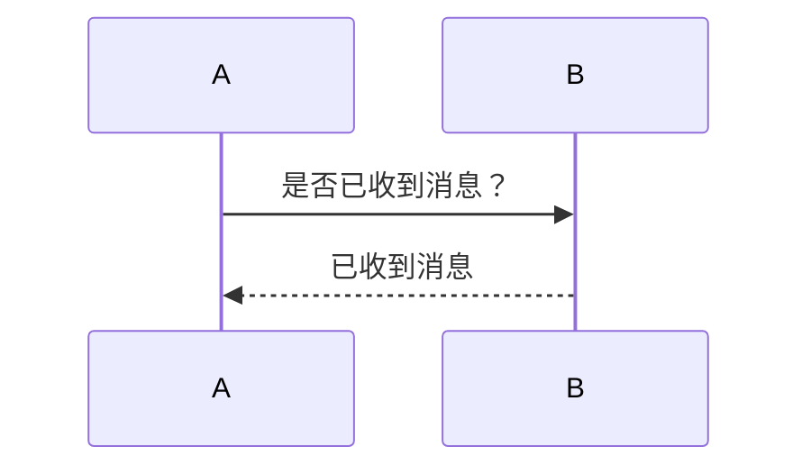
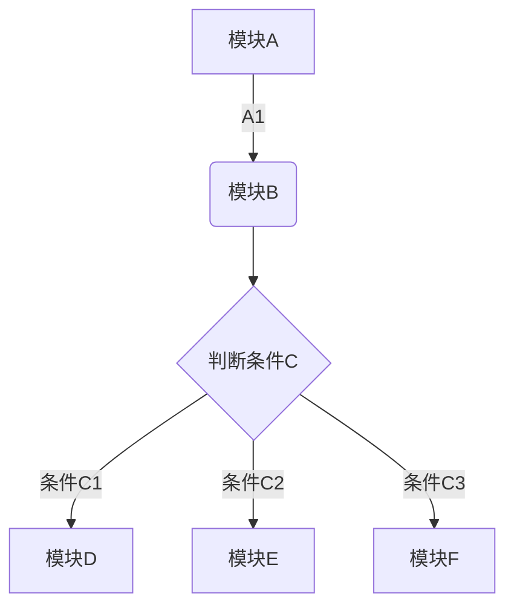
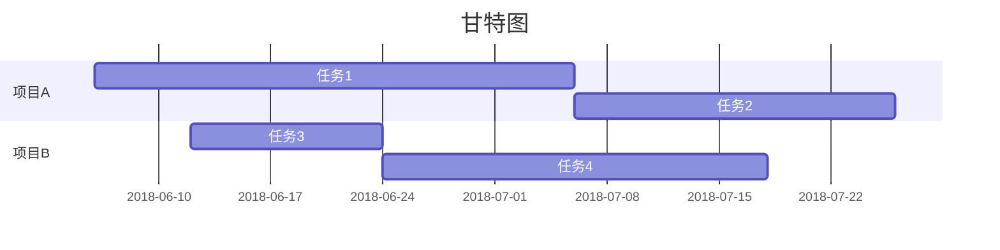

# Markdown 规范参考

2016年1月1日 通过 [typora.io](http://typora.io)

[官方原文链接](https://support.typora.io/Markdown-Reference/)

##  概观

**Markdown** 由 [Daring Fireball](http://daringfireball.net/) 创建; 原始指南就[在这里](https://daringfireball.net/projects/markdown/syntax)。但是，它的语法因不同的解析器或编辑器而异。**Typora** 正在使用 [GitHub ](https://help.github.com/articles/github-flavored-markdown/) **Flavored**  [Markdown](https://help.github.com/articles/github-flavored-markdown/) 。

##  块元素

###  段落和换行符

段落只是一行或多行连续的文本。在 markdown 源代码中，段落由两个或多个空行分隔。在 Typora 中，您只需要一个空行（按 `Return`一次）即可创建一个新段落。

按 `Shift`+ `Return` 可创建单个换行符。大多数其他降价解析器将忽略单换行符，因此为了使其他降价解析器识别换行符，您可以在行的末尾留下两个空格，或者插入 `<br/>`。

###  头

标题 `#` 在行的开头使用 1-6个hash（）字符，对应于标题级别1-6。例如：

```
# This is an H1

## This is an H2

###### This is an H6
```

在 Typora 中，输入’＃'后跟标题内容，`Return` 按键将创建标题。

###  引用文字

Markdown 使用电子邮件样式>字符进行块引用。它们表示为：

```ruby
> This is a blockquote with two paragraphs. This is first paragraph.
>
> This is second pragraph. Vestibulum enim wisi, viverra nec, fringilla in, laoreet vitae, risus.


> This is another blockquote with one paragraph. There is three empty line to seperate two blockquote.
```

在 Typora 中，输入 ‘>’ 后跟您的引用内容将生成一个引用块。Typora 将为您插入正确的 “>” 或换行符。通过添加额外级别的 “>” 嵌套块引号（另一个块引用内的块引用）。

###  清单

输入 `* list item 1` 将创建一个无序列表 - `*` 符号可以替换为`+`或`-`。

输入 `1. list item 1` 将创建一个有序列表 - 其降序源代码如下：

```ruby
## un-ordered list
*   Red
*   Green
*   Blue

## ordered list
1.  Red
2. 	Green
3.	Blue
```

###  任务列表

任务列表是标记为 [] 或 [x] （不完整或完整）的项目的列表。例如：

```ruby
- [ ] a task list item
- [ ] list syntax required
- [ ] normal **formatting**, @mentions, #1234 refs
- [ ] incomplete
- [x] completed
```

您可以通过单击项目前面的复选框来更改完整/不完整状态。

- [x] completed

###  （受控）代码块

Typora 仅支持 GitHub Flavored Markdown 中的栅栏。不支持 markdown 中的原始代码块。

使用栅栏很简单：输入

```cpp
[```]
```

然后按 return。在之后添加一个可选的语言标识符，我们将通过语法高亮显示它：

Here’s an example:

```cpp
function test() {
  console.log("notice the blank line before this function?");
}
```

syntax highlighting:

```ruby
require 'redcarpet'
markdown = Redcarpet.new("Hello World!")
puts markdown.to_html
```

###  数学块

您可以使用 **MathJax** 渲染 *LaTeX* 数学表达式。

要添加数学表达式，请输入 `$$` 并按“return”键。这将触发一个接受 *Tex / LaTex* 源的输入字段。例如：

$$
V1×V2=∣ijk∂X∂u∂Y∂u0∂X∂v∂Y∂v0∣\mathbf{V}_1 \times \mathbf{V}_2 =  \begin{vmatrix} \mathbf{i} & \mathbf{j} & \mathbf{k} \\ \frac{\partial X}{\partial u} &  \frac{\partial Y}{\partial u} & 0 \\ \frac{\partial X}{\partial v} &  \frac{\partial Y}{\partial v} & 0 \\ \end{vmatrix} V1×V2=∣∣∣∣∣∣i∂u∂X∂v∂Xj∂u∂Y∂v∂Yk00∣∣∣∣∣∣
$$

在 markdown 源文件中，math 块是由一对 ‘$$’ 标记包装的 *LaTeX* 表达式：

```ruby
$$
\mathbf{V}_1 \times \mathbf{V}_2 =  \begin{vmatrix}
\mathbf{i} & \mathbf{j} & \mathbf{k} \\
\frac{\partial X}{\partial u} &  \frac{\partial Y}{\partial u} & 0 \\
\frac{\partial X}{\partial v} &  \frac{\partial Y}{\partial v} & 0 \\
\end{vmatrix}
$$
```

你可以[在这里](https://support.typora.io/Math/)找到更多细节。

###  表

输入`| First Header | Second Header |`并 `return` 按键。这将创建一个包含两列的表。

创建表后，将焦点放在该表上将打开表的工具栏，您可以在其中调整表格的大小，对齐或删除。您还可以使用上下文菜单来复制和添加/删除单个列/行。

表的完整语法如下所述，但没有必要详细了解完整语法，因为表的 markdown 源代码是由 Typora 自动生成的。

在 markdown 源代码中，它们看起来像：

```ruby
| First Header  | Second Header |
| ------------- | ------------- |
| Content Cell  | Content Cell  |
| Content Cell  | Content Cell  |
```

您还可以在表格中包含内联 Markdown，例如链接，粗体，斜体或删除线。

最后，通过 `:` 在标题行中包含冒号（），您可以将该列中的文本定义为左对齐，右对齐或居中对齐：

```ruby
| Left-Aligned  | Center Aligned  | Right Aligned |
| :------------ |:---------------:| -----:|
| col 3 is      | some wordy text | $1600 |
| col 2 is      | centered        |   $12 |
| zebra stripes | are neat        |    $1 |
```

最左侧的冒号表示左对齐的列; 最右侧的冒号表示右对齐的列; 两侧的冒号表示中心对齐的列。

###  脚注

```ruby
You can create footnotes like this[^footnote].
[^footnote]: Here is the *text* of the **footnote**.
```

将产生：

你可以像这样创建脚注[1](https://support.typora.io/Markdown-Reference/#fn:footnote)。

将鼠标悬停在“脚注”上标上可查看脚注的内容。

###  横向规则

输入 `***` 或 `---` 在空行上按下 `return` 将绘制一条水平线。

------

###  YAML Front Matter

Typora 现在支持 [YAML Front Matter](https://jekyllrb.com/docs/frontmatter/)。输入 `---` 文章顶部，然后按 `Return` 以引入元数据块。或者，您可以从 Typora 的顶部菜单中插入元数据块。

###  目录（TOC）

输入 `[toc]` 并 `Return` 按键。这将创建一个“目录”部分。TOC 从文档中提取所有标题，并在添加到文档时自动更新其内容。

##  跨度元素

Span 类型将在键入后立即解析和呈现。将光标移动到这些 span 元素的中间会将这些元素扩展为 markdown 源。下面是每个 span 元素的语法说明。

###  链接

Markdown 支持两种链接样式：内联和引用。

在这两种样式中，链接文本由[方括号]分隔。

要创建内联链接，请在链接文本的结束方括号后立即使用一组常规括号。在括号内，将 URL 指向要指向的 URL，以及链接的可选标题，用引号括起来。例如：

```
This is [an example](https://example.com/ "Title") inline link.
[This link](https://example.net/) has no title attribute.
```

将产生：

这是[一个示例](https://example.com/"Title")内联链接。（`<p>This is <a href="http://example.com/" title="Title">`）

[此链接](https://example.net/)没有 title 属性。（`<p><a href="http://example.net/">This link</a> has no`）

##### 跳转到新标签页打开

`[This link](https://example.net/){:target="_blank"}`

####  内部链接

**您可以将href设置为标题**，这将创建一个书签，允许您在单击后跳转到该部分。例如：

命令（在Windows上：Ctrl）+ 单击[此链接](https://support.typora.io/Markdown-Reference/#block-elements)将跳转到标题 `Block Elements`。要查看如何编写，请移动光标或单击该按钮以 `⌘` 按下该键以将元素展开为降价源。

####  参考链接

参考样式链接使用第二组方括号，在其中放置您选择的标签以标识链接：

```ruby
This is [an example][id] reference-style link.

Then, anywhere in the document, you define your link label on a line by itself like this:

[id]: https://example.com/  "Optional Title Here"
```

在 Typora 中，它们将被渲染为：

这是[一个示例](https://example.com/)参考样式链接。

隐式链接名称快捷方式允许您省略链接的名称，在这种情况下，链接文本本身将用作名称。只需使用一组空的方括号 - 例如，将“Google”一词链接到 [google.com](http://google.com) 网站，您只需编写：

```ruby
[Google][]
And then define the link:

[Google]: https://google.com/
```

在 Typora 中，单击该链接将展开它以进行编辑，并且命令 + 单击将在 Web 浏览器中打开超链接。

###  网址

Typora 允许您将URL作为链接插入，用`<`括号括起来`>`。

`<i@typora.io>` 成为 [i@typora.io](mailto:i@typora.io)。

Typora 还会自动链接标准网址。例如：[www.google.com](http://www.google.com)。

###  图片

图像具有与链接类似的语法，但它们 `!` 在链接开始之前需要额外的字符。插入图像的语法如下所示：

```ruby


```

您可以使用拖放操作从图像文件或 Web 浏览器插入图像。您可以通过单击图像来修改降价源代码。如果使用拖放操作添加的图像与您当前正在编辑的文档位于同一目录或子目录中，则将使用相对路径。

如果您使用 markdown 构建网站，则可以在本地计算机上 `typora-root-url` 为 YAML Front Matters 中的属性指定图像预览的 URL 前缀。例如，`typora-root-url:/User/Abner/Website/typora.io/` 在 YAML Front Matters 中输入，然后 `` 将 ``在 Typora 中处理。

[](https://typora.io/img/drag-img.gif)

[拖放图像](https://typora.io/img/drag-img.gif)


###  重点

Markdown 将星号（`*`）和下划线（`_`）视为重点的指标。用一个包装的文本`*`或`_`将用 HTML `<em>` 标签包装的文本。例如：

```ruby
*single asterisks*
_single underscores_
```

输出：

*单个星号*

*单下划线*

GFM将忽略单词中的下划线，这通常用于代码和名称，如下所示：

> wow_great_stuff
>
> do_this_and_do_that_and_another_thing。

要在其它方式用作强调分隔符的位置生成文字星号或下划线，可以反斜杠转义：

```ruby
\*this text is surrounded by literal asterisks\*
```

Typora 建议使用该 `*` 符号。

###  强大

一个 double `*` 或 `_` 将导致其包含的内容用 HTML `<strong>` 标记包装，例如：

```ruby
**double asterisks**
__double underscores__
```

输出：

**双星号**

**双下划线**

Typora 建议使用该 `**` 符号。

###  码

要指示代码的内联跨度，请使用反引号（`）进行包装。与预格式化的代码块不同，代码跨度表示正常段落中的代码。例如：

```ruby
Use the `printf()` function.
```

将产生：

使用该 `printf()` 功能。

###  删除线

GFM 添加语法来创建删除线文本，标准 Markdown 中缺少该文本。

`~~Mistaken text.~~` 变 错误的文字。

~~Mistaken text.~~

###  下划线

下划线由原始 HTML 提供支持。

`<u>Underline</u>`成为下划线。

<u>Underline</u>

###  表情符号：开心：

使用语法输入表情符号`:smile:`。

😄

用户可以通过 `ESC` 按键触发表情符号的自动完成建议，或者在首选项面板上启用后自动触发表情符号。此外，在菜单栏中转到 `Edit`- > 也可以直接输入 UTF-8 表情符号字符 `Emoji & Symbols`。

###  内联数学

要使用此功能，请先在 `Preference` 面板 - > `Markdown`选项卡中启用它。然后，用于 `$` 包装 TeX 命令。例如：`$\lim_{x \to \infty} \exp(-x) = 0$`将呈现为 LaTeX 命令。

要触发内联数学的内联预览：输入“$”，然后 `ESC` 按键，然后输入 TeX 命令。

$\lim_{x \to \infty} \exp(-x) = 0$

你可以[在这里](https://support.typora.io/Math/)找到更多细节。

###  标

要使用此功能，请先在 `Preference` 面板 - > `Markdown`选项卡中启用它。然后，用于 `~` 包装下标内容。例如：`H~2~O`，`X~long\ text~`/

H~2~O，X~long\ text~/

###  标

要使用此功能，请先在 `Preference` 面板 - > `Markdown`选项卡中启用它。然后，`^` 用来包装上标内容。例如：`X^2^`。

X^2^

###  突出

要使用此功能，请先在 `Preference` 面板 - > `Markdown`选项卡中启用它。然后，用于 `==` 包装高亮内容。例如：`==highlight==`。

==highlight==

##  HTML

您可以使用 HTML 来设置纯 Markdown 不支持的内容。例如，用于 `<span style="color:red">this text is red</span>` 添加红色文本。

<span style="color:red">this text is red</span>

###  嵌入内容

有些网站提供基于 iframe 的嵌入代码，您也可以将其粘贴到 Typora 中。例如：

```ruby
<iframe height='265' scrolling='no' title='Fancy Animated SVG Menu' src='http://codepen.io/jeangontijo/embed/OxVywj/?height=265&theme-id=0&default-tab=css,result&embed-version=2' frameborder='no' allowtransparency='true' allowfullscreen='true' style='width: 100%;'></iframe>
```

<iframe height="265" scrolling="no" title="Fancy Animated SVG Menu" src="https://codepen.io/jeangontijo/embed/OxVywj/?height=265&amp;theme-id=0&amp;default-tab=css,result&amp;embed-version=2" frameborder="no" allowtransparency="true" allowfullscreen="true" style="width: 100%;"></iframe>

###  视频

您可以使用 `<video>`HTML 标记嵌入视频。例如：

```ruby
<video src="xxx.mp4" />
```

###  其他 HTML 支持

你可以[在这里](https://support.typora.io/HTML/)找到更多细节。

1. 这里是*文本*的的**注脚**。


##  一、Markdown

### [#](https://blog.kimen.com.cn/pages/ad247c4332211551/#简介)简介


`Markdown` 是一种轻量级标记语言，它允许人们使用易读易写的纯文本格式编写文档。

### [#](https://blog.kimen.com.cn/pages/ad247c4332211551/#应用)应用

当前许多网站都广泛使用 `Markdown` 来撰写帮助文档或是用于论坛上发表消息。例如：GitHub、简书、知乎等

### [#](https://blog.kimen.com.cn/pages/ad247c4332211551/#编辑器)编辑器

推荐使用`Typora`，官网：https://typora.io/

## [#](https://blog.kimen.com.cn/pages/ad247c4332211551/#二、徽章)二、徽章

#### [#](https://blog.kimen.com.cn/pages/ad247c4332211551/#什么是徽章)什么是徽章

徽章是一种小巧精美的小图标，一般配有相关文字进行辅助说明，可对数据进行监控，链接跳转等，富有表现力。

常见于`github`项目主页，但其不仅出现于 `github` 项目主页，凡是能够表现图片的地方都可以出现徽章。

#### [#](https://blog.kimen.com.cn/pages/ad247c4332211551/#徽章的使用)徽章的使用

- 在`markdown`中使用

```markdown
格式:
[](超链接地址)  # 即超链接内部嵌套图片

语法：
[](https://github.com/xugaoyi)
```


[](https://github.com/xugaoyi)

徽章生成网站：https://shields.io/

本文档主要介绍markdown，不对徽章做过多介绍，详细介绍请 [戳我 ](https://segmentfault.com/a/1190000019552597) 了解。

## [#](https://blog.kimen.com.cn/pages/ad247c4332211551/#三、设置目录)三、设置目录

设置之后会根据分级标题来自动生成目录。

```markdown
[TOC]
```


> 注：github暂未支持。

[TOC]

在github生成TOC的方法：https://github.com/ekalinin/github-markdown-toc

windows系统需要基于golang实现的工具：https://github.com/ekalinin/github-markdown-toc.go

> 如果你有GO语言的编译环境，可以尝试自己编译，如果没有，可以直接下载编译好的二进制文件。
>
> 如windows系统64位 下载：gh-md-toc.windows.amd64.tgz （386 是32位，amd64是64位）
>
> 下载解压后，发现没有后缀名无法识别，实际上这是个exe文件，所以只需要暴力地在后面加上.exe就可以开始愉快使用了。
>
> 使用方法：
>
> 1. 首先将.md文档复制到gh-md-toc.exe的根目录下
> 2. 在该目录下打开系统命令行，输入命令：gh-md-toc.exe README.MD 生成目录
> 3. 把生成的目录复制到.md文件即可。

**这是gh-md-toc生成的目录：**

- 一、Markdown
  - [简介](https://blog.kimen.com.cn/pages/ad247c4332211551/#简介)
  - [应用](https://blog.kimen.com.cn/pages/ad247c4332211551/#应用)
  - [编辑器](https://blog.kimen.com.cn/pages/ad247c4332211551/#编辑器)
- 二、徽章
  - [什么是徽章](https://blog.kimen.com.cn/pages/ad247c4332211551/#什么是徽章)
  - [徽章的使用](https://blog.kimen.com.cn/pages/ad247c4332211551/#徽章的使用)
- [三、设置目录](https://blog.kimen.com.cn/pages/ad247c4332211551/#三设置目录)
- [四、标题](https://blog.kimen.com.cn/pages/ad247c4332211551/#四标题)
- 一级标题
  - 二级标题
    - 三级标题
      - 四级标题
        - 五级标题
          - [六级标题](https://blog.kimen.com.cn/pages/ad247c4332211551/#六级标题)
  - 五、文本
    - [段落](https://blog.kimen.com.cn/pages/ad247c4332211551/#段落)
    - [字体](https://blog.kimen.com.cn/pages/ad247c4332211551/#字体)
    - [删除线](https://blog.kimen.com.cn/pages/ad247c4332211551/#删除线)
    - [下划线](https://blog.kimen.com.cn/pages/ad247c4332211551/#下划线)
    - [文字高亮](https://blog.kimen.com.cn/pages/ad247c4332211551/#文字高亮)
    - [分隔线](https://blog.kimen.com.cn/pages/ad247c4332211551/#分隔线)
    - [脚注](https://blog.kimen.com.cn/pages/ad247c4332211551/#脚注)
  - 六、列表
    - [无序列表](https://blog.kimen.com.cn/pages/ad247c4332211551/#无序列表)
    - [有序列表](https://blog.kimen.com.cn/pages/ad247c4332211551/#有序列表)
    - [折叠列表](https://blog.kimen.com.cn/pages/ad247c4332211551/#折叠列表)
    - [带复选框列表](https://blog.kimen.com.cn/pages/ad247c4332211551/#带复选框列表)
    - [列表嵌套](https://blog.kimen.com.cn/pages/ad247c4332211551/#列表嵌套)
  - 七、区块引用
    - [区块嵌套](https://blog.kimen.com.cn/pages/ad247c4332211551/#区块嵌套)
    - [区块中使用列表](https://blog.kimen.com.cn/pages/ad247c4332211551/#区块中使用列表)
    - [列表中使用区块](https://blog.kimen.com.cn/pages/ad247c4332211551/#列表中使用区块)
  - 八、代码
    - [代码区块](https://blog.kimen.com.cn/pages/ad247c4332211551/#代码区块)
  - 九、链接
    - [变量链接](https://blog.kimen.com.cn/pages/ad247c4332211551/#变量链接)
    - [Github中使用内部链接](https://blog.kimen.com.cn/pages/ad247c4332211551/#github中使用内部链接)
    - [锚点链接](https://blog.kimen.com.cn/pages/ad247c4332211551/#锚点链接)
  - 十、图片
    - [图片宽高](https://blog.kimen.com.cn/pages/ad247c4332211551/#图片宽高)
    - [相对路径以及Github中使用图片](https://blog.kimen.com.cn/pages/ad247c4332211551/#相对路径以及github中使用图片)
  - [十一、表格](https://blog.kimen.com.cn/pages/ad247c4332211551/#十一表格)
  - [十二、Emoji表情包](https://blog.kimen.com.cn/pages/ad247c4332211551/#十二emoji表情包)
  - 十三、其他技巧
    - [支持的 HTML 元素](https://blog.kimen.com.cn/pages/ad247c4332211551/#支持的-html-元素)
    - [转义](https://blog.kimen.com.cn/pages/ad247c4332211551/#转义)
    - [数学公式](https://blog.kimen.com.cn/pages/ad247c4332211551/#数学公式)
    - [图表](https://blog.kimen.com.cn/pages/ad247c4332211551/#图表)
    - [流程图](https://blog.kimen.com.cn/pages/ad247c4332211551/#流程图)
    - [时序图](https://blog.kimen.com.cn/pages/ad247c4332211551/#时序图)
    - [甘特图](https://blog.kimen.com.cn/pages/ad247c4332211551/#甘特图)

## [#](https://blog.kimen.com.cn/pages/ad247c4332211551/#四、标题)四、标题

```markdown
# 一级标题
## 二级标题
### 三级标题
#### 四级标题
##### 五级标题
###### 六级标题
```


# [#](https://blog.kimen.com.cn/pages/ad247c4332211551/#一级标题)一级标题

## [#](https://blog.kimen.com.cn/pages/ad247c4332211551/#二级标题)二级标题

### [#](https://blog.kimen.com.cn/pages/ad247c4332211551/#三级标题)三级标题

#### [#](https://blog.kimen.com.cn/pages/ad247c4332211551/#四级标题)四级标题

##### [#](https://blog.kimen.com.cn/pages/ad247c4332211551/#五级标题)五级标题

###### [#](https://blog.kimen.com.cn/pages/ad247c4332211551/#六级标题)六级标题

## [#](https://blog.kimen.com.cn/pages/ad247c4332211551/#五、文本)五、文本

### [#](https://blog.kimen.com.cn/pages/ad247c4332211551/#段落)段落

Markdown 段落没有特殊的格式，直接编写文字，**需要段落缩进时使用2个Tab**

### [#](https://blog.kimen.com.cn/pages/ad247c4332211551/#字体)字体

```markdown
*斜体文本* 
或 _斜体文本_
**粗体文本**
或  __粗体文本__
***粗斜体文本***
或 ___粗斜体文本___
```


*斜体文本*

*斜体文本*

**粗体文本**

**粗体文本**

***粗斜体文本***

***粗斜体文本***

### [#](https://blog.kimen.com.cn/pages/ad247c4332211551/#删除线)删除线

如果段落上的文字要添加删除线，只需要在文字的两端加上两个波浪线 **~~** 即可，实例如下：

```markdown
~~BAIDU.COM~~
```

BAIDU.COM

### [#](https://blog.kimen.com.cn/pages/ad247c4332211551/#下划线)下划线

下划线可以通过 HTML 的`<u>` 标签来实现：

```markdown
<u>带下划线的文本</u>
```


带下划线的文本

### [#](https://blog.kimen.com.cn/pages/ad247c4332211551/#文字高亮)文字高亮

文字高亮能使行内部分文字高亮，使用一对反引号。

```markdown
`html` `css` `javascript` 
```


```
html` `css` `javascript
```

### [#](https://blog.kimen.com.cn/pages/ad247c4332211551/#分隔线)分隔线

你可以在一行中用三个以上的星号、减号、底线来建立一个分隔线，行内不能有其他东西。你也可以在星号或是减号中间插入空格。下面每种写法都可以建立分隔线：

```markdown
***

*****

- - -

----------
```


------

### [#](https://blog.kimen.com.cn/pages/ad247c4332211551/#脚注)脚注

脚注是对文本的补充说明。

```markdown
[^变量]
在文档结尾或其他位置給变量赋值：
[^变量]: 注明框内显示的内容

鼠标移到这里> [^哈喽]
[^哈喽]: 注明框内显示的内容
```


> 注：在部分线上预览未支持

鼠标移到这里> [^哈喽](https://blog.kimen.com.cn/pages/ad247c4332211551/注明框内显示的内容)

## [#](https://blog.kimen.com.cn/pages/ad247c4332211551/#六、列表)六、列表

### [#](https://blog.kimen.com.cn/pages/ad247c4332211551/#无序列表)无序列表

使用星号`*`、加号`+`或是减号`-`作为列表标记：

```markdown
* 第一项
* 第二项

+ 第一项
+ 第二项

- 第一项
- 第二项
```


- 第一项
- 第二项

### [#](https://blog.kimen.com.cn/pages/ad247c4332211551/#有序列表)有序列表

使用数字并加上`.` 号来表示

```markdown
1. 第一项
2. 第二项
```


1. 第一项
2. 第二项

### [#](https://blog.kimen.com.cn/pages/ad247c4332211551/#折叠列表)折叠列表

```markdown
<details>
<summary>点我打开关闭折叠</summary>
 折叠内容
 <ul>
     <li>1</li>
     <li>2</li>
     <li>3</li>
 </ul>
</details>
```


> 注意：<details> 标签内写markdown代码无效，可写html代码，如ul>li、table等

<details style="color: rgb(0, 50, 60); font-family: -apple-system, system-ui, &quot;Segoe UI&quot;, Roboto, Oxygen, Ubuntu, Cantarell, &quot;Fira Sans&quot;, &quot;Droid Sans&quot;, &quot;Helvetica Neue&quot;, sans-serif; font-size: 16px; font-style: normal; font-variant-ligatures: normal; font-variant-caps: normal; font-weight: 400; letter-spacing: normal; orphans: 2; text-align: start; text-indent: 0px; text-transform: none; white-space: normal; widows: 2; word-spacing: 0px; -webkit-text-stroke-width: 0px; background-color: rgb(255, 255, 255); text-decoration-thickness: initial; text-decoration-style: initial; text-decoration-color: initial;"><summary>点我打开关闭折叠</summary></details>

<details style="color: rgb(0, 50, 60); font-family: -apple-system, system-ui, &quot;Segoe UI&quot;, Roboto, Oxygen, Ubuntu, Cantarell, &quot;Fira Sans&quot;, &quot;Droid Sans&quot;, &quot;Helvetica Neue&quot;, sans-serif; font-size: 16px; font-style: normal; font-variant-ligatures: normal; font-variant-caps: normal; font-weight: 400; letter-spacing: normal; orphans: 2; text-align: start; text-indent: 0px; text-transform: none; white-space: normal; widows: 2; word-spacing: 0px; -webkit-text-stroke-width: 0px; background-color: rgb(255, 255, 255); text-decoration-thickness: initial; text-decoration-style: initial; text-decoration-color: initial;"><summary>包含table的折叠</summary></details>

### [#](https://blog.kimen.com.cn/pages/ad247c4332211551/#带复选框列表)带复选框列表

```markdown
* [x] 第一项
* [ ] 第二项
* [ ] 第三项
```


> 注：在部分线上预览未支持

- [x] 第一项
- [ ] 第二项
- [ ] 第三项

### [#](https://blog.kimen.com.cn/pages/ad247c4332211551/#列表嵌套)列表嵌套

```markdown
1. 第一项：
    - 第一项嵌套的第一个元素
    - 第一项嵌套的第二个元素
2. 第二项：
    - 第二项嵌套的第一个元素
       - 第三层嵌套
```


1. 第一项
   - 嵌套1
   - 嵌套2
2. 第二项
   - 嵌套1
     - 嵌套2

## [#](https://blog.kimen.com.cn/pages/ad247c4332211551/#七、区块引用)七、区块引用

区块引用是在段落开头使用 `>`符号 ，然后后面紧跟一个**空格**符号：

```markdown
> 区块引用
```


> 区块引用
>
> Typora中回车键自动延伸区块

#### [#](https://blog.kimen.com.cn/pages/ad247c4332211551/#区块嵌套)区块嵌套

```markdown
> 第一层
> > 第二层
> > > 第三层
```


> 第一层
>
> > 第二层
> >
> > > 第三层

#### [#](https://blog.kimen.com.cn/pages/ad247c4332211551/#区块中使用列表)区块中使用列表

```markdown
> 区块中使用列表
> 1. 第一项
> 2. 第二项
> * 111
> * 222
```


> 区块中使用列表
>
> 1. 第一项
> 2. 第二项
>    - 111
>    - 222

#### [#](https://blog.kimen.com.cn/pages/ad247c4332211551/#列表中使用区块)列表中使用区块

```markdown
* 第一项
    > 区块
* 第二项
```


- 第一项

  > 区块
  >
  > 区块

- 第二项

## [#](https://blog.kimen.com.cn/pages/ad247c4332211551/#八、代码)八、代码

如果是段落上的一个代码片段可以用反引号把它包起来（**`**），示例：

```markdown
`alert()` 
```


```
alert()
```

### [#](https://blog.kimen.com.cn/pages/ad247c4332211551/#代码区块)代码区块

用三个反引号 **```** 包裹一段代码，并指定一种语言（也可以不指定），指定代码语言后会有代码的颜色高亮

本代码区块为示例说明：

~~~markdown
```javascript
function test() {
	alert('test')
}
```
~~~


效果：

```javascript
function test() {
	alert('test')
}
```


## [#](https://blog.kimen.com.cn/pages/ad247c4332211551/#九、链接)九、链接

格式：

```markdown
[链接名称](链接地址)

[链接名称](链接地址,可选的alt)

或

<链接地址>
```


示例：

```markdown
[百度](http://www.baidu.com,'百度')
```


[百度](http://www.baidu.xn--com%2C''-p19wu55v/)

直接显示链接地址：

```markdown
<http://www.baidu.com>
```


[http://www.baidu.com](http://www.baidu.com/)

### [#](https://blog.kimen.com.cn/pages/ad247c4332211551/#变量链接)变量链接

链接可以用变量来代替，文档末尾或其他位置附带变量地址：

```markdown
这个链接用 1 作为网址变量 [Google][1]
这个链接用 baidu 作为网址变量 [Baidu][baidu]

然后在文档的结尾或其他位置给变量赋值（网址）
  [1]: http://www.google.com/
  [baidu]: http://www.baidu.com/
```


这个链接用 1 作为网址变量 [Google](http://www.google.com/)

这个链接用 baidu 作为网址变量 [Baidu](http://www.baidu.com/)

### [#](https://blog.kimen.com.cn/pages/ad247c4332211551/#github仓库中使用内部链接)Github仓库中使用内部链接

```markdown
可使用相对路径（前提是有该路径下的文件）
[test](test.md)
```


[test](https://blog.kimen.com.cn/03.技术/01.技术文档/md-img/test.html)

### [#](https://blog.kimen.com.cn/pages/ad247c4332211551/#锚点链接)锚点链接

本文件中每一个标题都是一个锚点，和HTML的锚点（`#`）类似

```markdown
[Markdown](#Markdown)
```


> 注： github对含有标点符号的标题进行锚点时会忽略掉标点符号， 本页中，如果这样写则无法跳转：[链接](#九、链接) 正确写法：[链接](#九链接)

[Markdown](https://blog.kimen.com.cn/pages/ad247c4332211551/#一Markdown)

[链接](https://blog.kimen.com.cn/pages/ad247c4332211551/#九链接)

[流程图](https://blog.kimen.com.cn/pages/ad247c4332211551/#流程图)

## [#](https://blog.kimen.com.cn/pages/ad247c4332211551/#十、图片)十、图片

和链接的区别是前面多一个感叹号`!`

```markdown

```


当然，你也可以像链接那样对图片地址使用变量:

```markdown
这里链接用 img 作为图片地址变量 
然后在文档的结尾或其他位置给变量赋值（图片地址）
![RUNOOB][img]
[img]: https://raw.githubusercontent.com/xugaoyi/image_store/master/blog/md_logo.png
```


### [#](https://blog.kimen.com.cn/pages/ad247c4332211551/#图片宽高)图片宽高

如下想设置图片宽高，可以使用 `` 标签。

```html

```


### [#](https://blog.kimen.com.cn/pages/ad247c4332211551/#相对路径以及github中使用图片)相对路径以及Github中使用图片

不管是在本地还是在github同一个仓库中，如果图片存在，可以使用**相对路径**。

相对路径图片：

```markdown

```

github上如果引用其他github仓库中的图片则要注意地址格式：`仓库地址/raw/分支名/图片路径` 或 `https://raw.githubusercontent.com/用户名/仓库名/分支名/图片路径`

```markdown

或

```


## [#](https://blog.kimen.com.cn/pages/ad247c4332211551/#十一、表格)十一、表格

制作表格使用 `|`来分隔不同的单元格，使用`-`来分隔表头和其他行。

```markdown
|  表头   | 表头  |
|  ----  | ----  |
| 单元格  | 单元格 |
| 单元格  | 单元格 |
```


|  表头  |  表头  |
| :----: | :----: |
| 单元格 | 单元格 |
| 单元格 | 单元格 |


**对齐方式**

- **-:** 设置内容和标题栏居右对齐
- **:-** 设置内容和标题栏居左对齐
- **:-:** 设置内容和标题栏居中对齐

```markdown
| 左对齐 | 右对齐 | 居中对齐 |
| :-----| ----: | :----: |
| 单元格 | 单元格 | 单元格 |
| 单元格 | 单元格 | 单元格 |
```


| 左对齐 | 右对齐 | 居中对齐 |
| :----- | -----: | :------: |
| 单元格 | 单元格 |  单元格  |
| 单元格 | 单元格 |  单元格  |


## [#](https://blog.kimen.com.cn/pages/ad247c4332211551/#十二、emoji表情包)十二、Emoji表情包

Emoji表情英文名的前后加冒号，Typore上先输入冒号再输入首字母有表情提示

```markdown
:smirk:
```

💋 😸🙈🐴 😏😊😃😄 ☀️

更多表情名称请查看：[表情包清单](https://www.webfx.com/tools/emoji-cheat-sheet/)

## [#](https://blog.kimen.com.cn/pages/ad247c4332211551/#十三、其他技巧)十三、其他技巧

### [#](https://blog.kimen.com.cn/pages/ad247c4332211551/#支持的-html-元素)支持的 HTML 元素

不在 Markdown 语法涵盖范围之内的标签，都可以直接在文档里面用 HTML 撰写。

目前支持的 HTML 元素有：`<kbd> <b> <i> <em> <sup> <sub> <br>`等等 ，如：

```markdown
使用 <kbd>Ctrl</kbd>+<kbd>Alt</kbd>+<kbd>Del</kbd> 重启电脑
```

使用 Ctrl+Alt+Del 重启电脑

**我是使用b标签的加粗字体**

### [#](https://blog.kimen.com.cn/pages/ad247c4332211551/#转义)转义

Markdown 使用了很多特殊符号来表示特定的意义，如果需要显示特定的符号则需要使用反斜杠转义字符：

```markdown
**未转义星号显示加粗** 
\*\* 转义显示星号 \*\*
```


**未转义星号显示加粗** ** 转义显示星号 **

Markdown 支持以下这些符号前面加上反斜杠来帮助插入普通的符号：

```markdown
\   反斜线
`   反引号
*   星号
_   下划线
{}  花括号
[]  方括号
()  小括号
#   井字号
+   加号
-   减号
.   英文句点
!   感叹号
```


------

*** **以下部分在Github或其他在线预览中暂未支持** ***

------

### [#](https://blog.kimen.com.cn/pages/ad247c4332211551/#数学公式)数学公式

当你需要在编辑器中插入数学公式时，可以使用两个美元符 $$ 包裹 TeX 或 LaTeX 格式的数学公式来实现。提交后，问答和文章页会根据需要加载 Mathjax 对数学公式进行渲染。如：

```markdown
$$
\mathbf{V}_1 \times \mathbf{V}_2 =  \begin{vmatrix} 
\mathbf{i} & \mathbf{j} & \mathbf{k} \\
\frac{\partial X}{\partial u} &  \frac{\partial Y}{\partial u} & 0 \\
\frac{\partial X}{\partial v} &  \frac{\partial Y}{\partial v} & 0 \\
\end{vmatrix}
$$tep1}{\style{visibility:hidden}{(x+1)(x+1)}}
$$
```


$$ \mathbf{V}_1 \times \mathbf{V}_2 = \begin{vmatrix} \mathbf{i} & \mathbf{j} & \mathbf{k} \ \frac{\partial X}{\partial u} & \frac{\partial Y}{\partial u} & 0 \ \frac{\partial X}{\partial v} & \frac{\partial Y}{\partial v} & 0 \ \end{vmatrix} $$

### [#](https://blog.kimen.com.cn/pages/ad247c4332211551/#图表)图表

~~~markdown
```chart
,Budget,Income,Expenses,Debt
June,5000,8000,4000,6000
July,3000,1000,4000,3000
Aug,5000,7000,6000,3000
Sep,7000,2000,3000,1000
Oct,6000,5000,4000,2000
Nov,4000,3000,5000,

type: pie
title: Monthly Revenue
x.title: Amount
y.title: Month
y.suffix: $
```

~~~


> 注：在Typora中未支持

```text
,Budget,Income,Expenses,Debt
June,5000,8000,4000,6000
July,3000,1000,4000,3000
Aug,5000,7000,6000,3000
Sep,7000,2000,3000,1000
Oct,6000,5000,4000,2000
Nov,4000,3000,5000,

type: pie
title: Monthly Revenue
x.title: Amount
y.title: Month
y.suffix: $
```


### [#](https://blog.kimen.com.cn/pages/ad247c4332211551/#流程图)流程图

~~~markdown
语法：

~~~


流程图相关文章：

https://www.jianshu.com/p/b421cc723da5

http://www.imooc.com/article/292708

```text
graph TD
A[模块A] -->|A1| B(模块B)
B --> C{判断条件C}
C -->|条件C1| D[模块D]
C -->|条件C2| E[模块E]
C -->|条件C3| F[模块F]
```


### [#](https://blog.kimen.com.cn/pages/ad247c4332211551/#时序图)时序图

~~~markdown

~~~


```text
sequenceDiagram
A->>B: 是否已收到消息？
B-->>A: 已收到消息
```


### [#](https://blog.kimen.com.cn/pages/ad247c4332211551/#甘特图)甘特图

~~~markdown

~~~


```text
gantt
title 甘特图
dateFormat  YYYY-MM-DD
section 项目A
任务1           :a1, 2018-06-06, 30d
任务2     :after a1  , 20d
section 项目B
任务3      :2018-06-12  , 12d
任务4      : 24d
```

